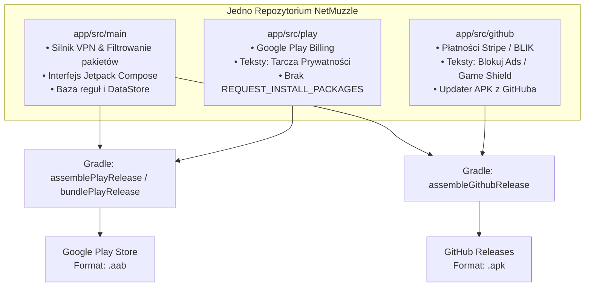

# Plan Architektury Open Source, Wariantów (Flavors) i Dystrybucji 🛡️

Dokument opisuje kompleksową strategię rozwoju aplikacji **NetMuzzle** w modelu **pełnego Open Source**, z podziałem na dwa niezależne kanały dystrybucji: **Google Play Store** oraz **GitHub Releases (Sideloading)**.

---

## SPIS TREŚCI
1. [Cel Strategiczny i Podsumowanie Założeń](#1-cel-strategiczny-i-podsumowanie-założeń)
2. [Konfiguracja Gradle i Product Flavors (`build.gradle.kts`)](#2-konfiguracja-gradle-i-product-flavors-buildgradlekts)
3. [Strategia Nazewnictwa i Zasobów (Resource Overlay)](#3-strategia-nazewnictwa-i-zasobów-resource-overlay)
4. [Architektura Rozdzielenia Płatności (Google Play Billing vs Stripe)](#4-architektura-rozdzielenia-płatności-google-play-billing-vs-stripe)
5. [Bezpieczeństwo Kodu i Ochrona Prawna (Licencja Open Source)](#5-bezpieczeństwo-kodu-i-ochrona-prawna-licencja-open-source)
6. [Wymagania i Procedura Publikacji w Google Play](#6-wymagania-i-procedura-publikacji-w-google-play)
7. [Codzienny Workflow Programisty i Procedura Wydań](#7-codzienny-workflow-programisty-i-procedura-wydań)

---

## 1. Cel Strategiczny i Podsumowanie Założeń

* **Model biznesowy/społecznościowy:** Pełny Open Source (budujący zaufanie użytkowników narzędzia VPN/Firewall).
* **Zgodność z polityką Google Play:** Zgodność z politykami *Device and Network Abuse* oraz *VpnService Policy* poprzez pozycjonowanie aplikacji jako **Selektywny Firewall Aplikacji i Tarcza Prywatności** (zamiast bezpośredniego AdBlockera).
* **Jedno wspólne repozytorium:** 95% kodu w `src/main`, a różnice (teksty, bramki płatności, uprawnienia aktualizacji) odseparowane w wariantach `play` i `github`.



---

## 2. Konfiguracja Gradle i Product Flavors (`build.gradle.kts`)

### A. Wymiary i warianty
W pliku `app/build.gradle.kts` definiujemy wymiar dystrybucji:

```kotlin
android {
    ...
    flavorDimensions += "distribution"

    productFlavors {
        create("play") {
            dimension = "distribution"
            buildConfigField("Boolean", "ENABLE_GITHUB_UPDATER", "false")
            buildConfigField("String", "DISTRIBUTION_CHANNEL", "\"google_play\"")
        }

        create("github") {
            dimension = "distribution"
            buildConfigField("Boolean", "ENABLE_GITHUB_UPDATER", "true")
            buildConfigField("String", "DISTRIBUTION_CHANNEL", "\"github\"")
        }
    }
}
```

### B. Rozdzielenie zależności (Dependencies)
Biblioteki specyficzne dla danego kanału kompilują się wyłącznie do swojego wariantu:

```kotlin
dependencies {
    // Wspólne zależności (Compose, Coroutines, DataStore itp.)
    implementation("androidx.core:core-ktx:1.13.1")
    ...

    // TYLKO DLA GOOGLE PLAY (Wymóg sklepu, brak prowizji zewnętrznej)
    playImplementation("com.android.billingclient:billing-ktx:6.2.1")

    // TYLKO DLA GITHUBA (Stripe SDK dla płatności bezpośrednich)
    githubImplementation("com.stripe:stripe-android:20.48.0")
}
```

### C. Rozdzielenie uprawnień w Manifestach
* **Wersja GitHub:** posiada `app/src/github/AndroidManifest.xml`:
  ```xml
  <manifest xmlns:android="http://schemas.android.com/apk/res/android">
      <uses-permission android:name="android.permission.REQUEST_INSTALL_PACKAGES" />
  </manifest>
  ```
* **Wersja Play:** nie posiada tego pliku ani uprawnienia, dzięki czemu Google Play nie odrzuca aplikacji.

---

## 3. Strategia Nazewnictwa i Zasobów (Resource Overlay)

System kompilacji Androida automatycznie nadpisuje zasoby z `src/main` plikami znajdującymi się w folderach wariantów.

### Mapa mapowania pojęć:

| Identyfikator zasobu | Wariant `src/github` (Sideloading) | Wariant `src/play` (Google Play) |
| :--- | :--- | :--- |
| `app_name` | `NetMuzzle` | `NetMuzzle Firewall` |
| `mode_adblock` | `Blokuj Ads` / `Block Ads` | `Tarcza Prywatności` / `Privacy Shield` |
| `menu_adblock_filters` | `Filtry reklam w grach` | `Filtry telemetrii i analityki` |
| `adblock_manager_desc` | `Zarządzaj sieciami reklamowymi blokowanymi w grach...` | `Zarządzaj serwerami telemetrycznymi i trackerami zbierającymi dane...` |
| `help_mode_adblock_desc` | `Wycina reklamy (Unity, AdMob itp.).` | `Blokuje serwery analityczne i ogranicza zużycie danych w tle.` |

> **W kodzie Kotlin/Compose:**  
> W widokach zawsze odwołujemy się do `stringResource(R.string.mode_adblock)` – właściwy napis podmienia Gradle w trakcie budowania.

---

## 4. Architektura Rozdzielenia Płatności (Google Play Billing vs Stripe)

### Krok 1: Wspólny kontrakt (Interfejs w `src/main`)
```kotlin
// app/src/main/java/com/netmuzzle/firewall/billing/BillingManager.kt
interface BillingManager {
    val isProUnlocked: StateFlow<Boolean>
    fun launchPurchaseFlow(activity: Activity)
    fun restorePurchases()
}
```

### Krok 2: Implementacja dla Google Play (`src/play`)
* Korzysta z `BillingClient` od Google.
* Zakup automatycznie weryfikowany przez konto Google użytkownika.

### Krok 3: Implementacja dla GitHuba (`src/github`)
* Korzysta z Stripe SDK lub linku do Stripe Checkout.
* Aktywacja wersji PRO odbywa się poprzez wpisanie klucza licencyjnego lub logowanie e-mail.

### Krok 4: Wspólny widok UI (w `src/main`)
Ekrany ustawień i okna „Odblokuj PRO” wywołują `billingManager.launchPurchaseFlow(activity)` – logika prezentacji jest w 100% wspólna.

---

## 5. Bezpieczeństwo Kodu i Ochrona Prawna (Licencja Open Source)

### A. Rekomendacja licencji: Przejście z MIT na GPLv3
* **Stan obecny:** Projekt posiada licencję `MIT` w pliku `LICENSE`. Pozwala ona każdemu na skopiowanie kodu, zmianę nazwy i sprzedaż aplikacji w Google Play bez udostępniania kodu źródłowego.
* **Zalecana zmiana:** **GNU General Public License v3 (GPLv3)** (standard dla Signal, NetGuard, ProtonVPN).
  * Każda osoba/firma bazująca na Twoim kodzie **musi** również udostępnić swój kod na licencji GPLv3.
  * Zabezpiecza to przed nieuczciwymi klonami na Google Play.

### B. Ochrona kluczy i sekretów
* Plik produkcyjny `netmuzzle-release.keystore` znajduje się w `.gitignore` i **nigdy nie trafił do historii Git-a**.
* Do GitHuba trafia wyłącznie klucz publiczny Stripe (`pk_live_...`). Klucze tajne (`sk_live_...`) nigdy nie mogą znaleźć się w kodzie aplikacji mobilnej.

---

## 6. Wymagania i Procedura Publikacji w Google Play

### A. Wymagania formalne konta
1. **Opłata rejestracyjna:** 25 USD w [Google Play Console](https://play.google.com/console).
2. **Weryfikacja tożsamości:** Dokument tożsamości + potwierdzenie adresu.
3. **Zasada 20 testerów (Closed Testing):** Nowe konta prywatne wymagają przeprowadzenia 14-dniowych testów zamkniętych z udziałem min. 20 testerów przed dopuszczeniem do produkcji.

### B. Formularz deklaracji VpnService w konsoli
* **Kategoria deklaracji:** *Device Security / Firewall*.
* **Uzasadnienie (do wklejenia w konsoli):**
  > „NetMuzzle to lokalny firewall sieciowy działający bez uprawnień root. Używa interfejsu VpnService wyłącznie lokalnie na urządzeniu, nie przesyłając żadnych danych na zewnętrzne serwery proxy. Usługa jest niezbędna do filtrowania pakietów i umożliwienia użytkownikowi blokowania dostępu do internetu wybranym aplikacjom oraz blokowania niezaufanych domen telemetrycznych.”
* **Wideo demonstracyjne:** Krótkie nagranie unlisted na YouTube prezentujące odcięcie internetu wybranej aplikacji za pomocą firewalla.

### C. Polityka prywatności
Wymagany link: `https://mastai-dev.github.io/NetMuzzle/privacy.html` (aktywny z folderu `docs/` przez GitHub Pages).

---

## 7. Codzienny Workflow Programisty i Procedura Wydań

### A. Codzienne programowanie
1. **Gdzie piszesz kod:** Zawsze w folderze `app/src/main/` (silnik VPN, interfejs Jetpack Compose, obsługa reguł).
2. **Wybór wariantu w Android Studio:**
   * Zakładka **Build Variants** w lewym dolnym rogu ekranu:
     * `githubDebug` – testowanie z pełnymi tekstami o reklamach i updaterem APK.
     * `playDebug` – testowanie wersji sklepowej (Tarcza Prywatności, Google Billing).

### B. Procedura wydania nowej wersji (Release Checklist)
1. **Podniesienie wersji:**
   * Zwiększ `versionCode` i `versionName` w [app/build.gradle.kts](file:///c:/antigravity/LightVPN/app/build.gradle.kts).
   * Zaktualizuj numery i release notes w [version.json](file:///c:/antigravity/LightVPN/version.json).
2. **Kompilacja paczek produkcyjnych:**
   W terminalu PowerShell wykonaj:
   ```powershell
   # Buduje plik APK dla GitHuba oraz paczkę AAB dla Google Play
   ./gradlew assembleGithubRelease bundlePlayRelease
   ```
3. **Wygenerowane pliki wyjściowe:**
   * `app/build/outputs/apk/github/release/app-github-release.apk` 👉 Dodaj do nowego wydania (Release) na GitHubie.
   * `app/build/outputs/bundle/playRelease/app-play-release.aab` 👉 Przeciągnij i upuść w Google Play Console.
