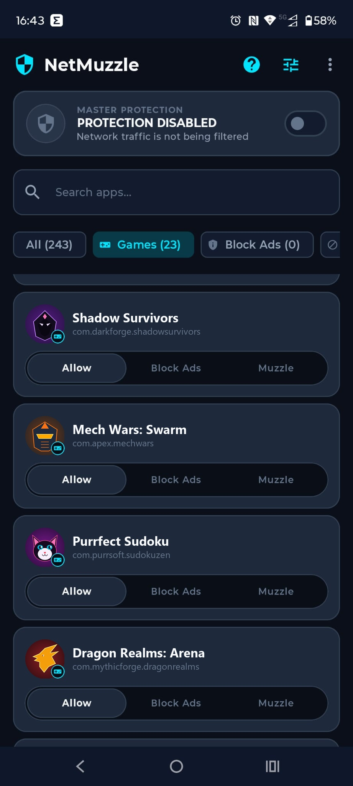
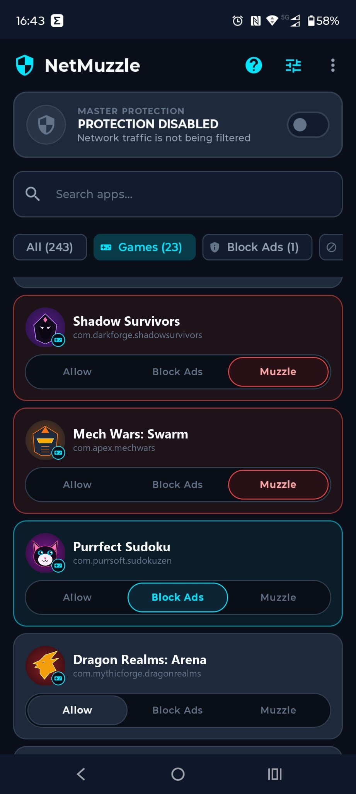
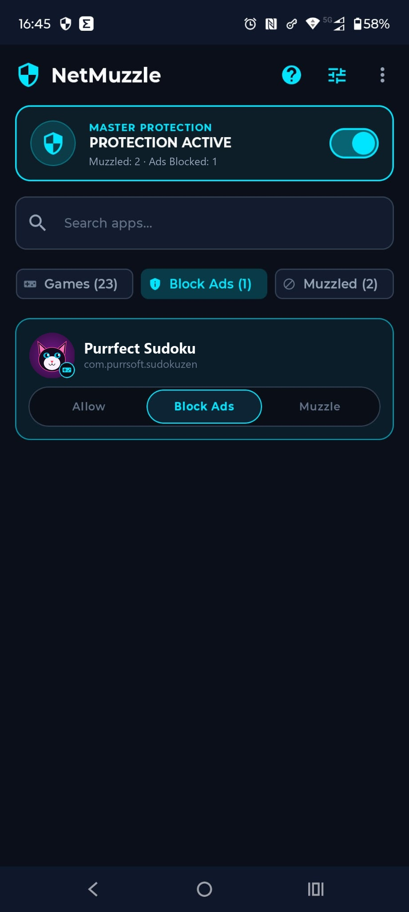
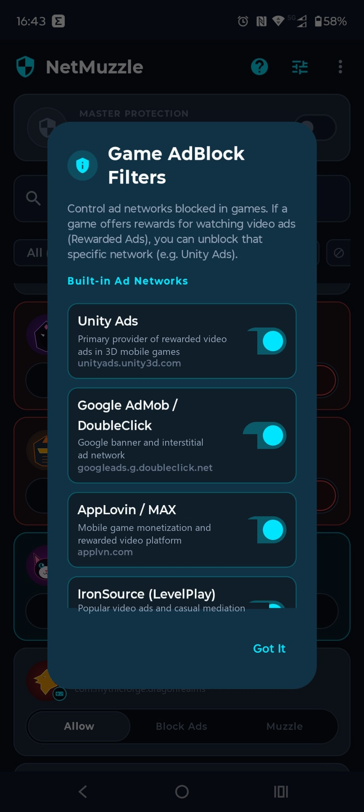

# NetMuzzle 🛡️

<p align="center">
  <a href="README.md">English</a> • <strong>Polski</strong>
</p>

<p align="center">
  
</p>

<p align="center">
  <strong>Ultra-lekki firewall i pogromca reklam w grach na Androida (No-Root)</strong><br>
  <em>Bez roota. Zero drenażu baterii. Brak pętli analizy pakietów. Czysta wydajność jądra Linux.</em>
</p>

<p align="center">
  <a href="https://github.com/mastai-dev/NetMuzzle/releases/latest"></a>
  <a href="https://github.com/mastai-dev/NetMuzzle/releases"></a>
  <a href="https://android.com"></a>
  <a href="LICENSE"></a>
  <a href="https://github.com/mastai-dev/NetMuzzle/actions"></a>
</p>

<p align="center">
  <a href="https://github.com/mastai-dev/NetMuzzle/releases/download/v1.3.5/NetMuzzle-v1.3.5.apk">
    
  </a>
  <a href="https://mastai-dev.github.io/NetMuzzle/">
    
  </a>
</p>

---

## ⚡ Dlaczego NetMuzzle?

Większość tradycyjnych firewalli na Androida (takich jak NetGuard czy popularne blokery VPN) **przepuszcza 100% ruchu urządzenia do przestrzeni użytkownika**, odczytując i zapisując każdy pakiet w pętli procesora. To ciągłe filtrowanie przegrzewa procesor, drenuje baterię i powoduje opóźnienia (*lagi*) w grach online.

**NetMuzzle działa dokładnie odwrotnie, stawiając na bezkompromisową architekturę:**

1. 🚀 **0% Zużycia Procesora i Brak Drenażu Baterii (Selektywna Czarna Dziura):**  
   Aplikacje dopuszczone **całkowicie omijają silnik VPN** bezpośrednio na poziomie jądra systemu Linux (`addAllowedApplication`). 99% ruchu sieciowego w ogóle nie dotyka naszej aplikacji, a pętle pakietów natychmiast zasypiają w stanie bezczynności.
2. 🎮 **Tarcza Reklam w Grach:**  
   Graj w gry mobilne bez natrętnych 30-sekundowych reklam wideo! Nasza lekka tarcza DNS wycina domeny reklamowe (Unity Ads, Google AdMob, AppLovin, IronSource, Mintegral itp.), podczas gdy serwery gry, tabele wyników i tryb wieloosobowy działają z pełną prędkością łącza.
3. 🎯 **Pływający Kontroler w Grach z Automatycznym Timerem:**  
   Pływający przycisk (overlay) wyświetlany bezpośrednio na wierzchu Twojej ulubionej gry. Chcesz obejrzeć reklamę za darmowe diamenty lub dodatkowe życie? Wystarczy 1 kliknięcie, aby tymczasowo wstrzymać blokowanie reklam *wyłącznie dla aktywnej gry* (bez rozłączania VPN czy odblokowywania innych aplikacji). Konfigurowalny timer (30s, 45s, 60s, 90s, 120s) automatycznie przywraca blokadę po obejrzeniu filmu! Przycisk można swobodnie przeciągać i ustawić w dowolnym miejscu ekranu.
4. 💊 **Nowoczesna Tekstowa Kapsuła 3-Stanowa:**  
   Przejrzyste, czytelne etykiety (`Zezwalaj` | `Blokuj Ads` | `Kaganiec`) z neonowym podświetleniem aktywnego trybu wewnątrz każdego kafelka aplikacji.
5. 🔍 **Pasek 4 Filtrów i Taktyczny Pusty Stan:**  
   Błyskawiczne filtrowanie aplikacji według kategorii: `Wszystkie`, `🎮 Gry`, `🛡️ Blokada Ads` oraz `🚫 Kaganiec` z dynamicznymi licznikami aplikacji i 1-klikowym resetem filtrów.
6. 🎁 **Kontrola nad Reklamami z Nagrodami (Rewarded Ads):**  
   Potrzebujesz darmowych monet, diamentów lub dodatkowego życia w grze? Wystarczy jeden klik w ustawieniach, aby tymczasowo odblokować sieć (np. Unity Ads) i odebrać nagrodę za film!
7. 📡 **Inspektor Ruchu z Kopiowaniem Domen do Schowka:**  
   Wykrywaj nieznane serwery reklam na żywo! Uruchom diagnozę, włącz grę i obserwuj zapytania DNS w czasie rzeczywistym. Przytrzymaj domenę, aby natychmiast skopiować ją do schowka, lub zablokuj ją 1 kliknięciem.
8. 🔒 **Pancerna Szczelność (Zero Wycieków DNS) i Błyskawiczny TCP RST (Wzmocnione w v1.3.4):**  
   Zablokowane programy otrzymują martwe lokalne serwery DNS (`10.0.0.1` oraz `fd00::2`). Zablokowany ruch TCP natychmiast otrzymuje syntetyczny pakiet `RST+ACK` (zarówno IPv4 jak i IPv6) eliminujący 30-sekundowe zawieszenia połączeń. Routing przechwytuje zapytania do 8 głównych publicznych dostawców DNS (brak wycieków DoH), a atrybucja UID w Android 8–9 korzysta z parsera kernela procfs.

---

## 📊 Porównanie: NetMuzzle na tle konkurencji

| Cecha / Parametr | Tradycyjne firewalle VPN (np. NetGuard) | Filtry Root / Hosts (AdAway, iptables) | **NetMuzzle 🛡️ (v1.3.5)** |
| :--- | :---: | :---: | :---: |
| **Wymaga uprawnień Roota?** | ❌ Nie | ⚠️ Tak (Utrata gwarancji) | 🟢 **Nie (Bez roota)** |
| **Zużycie baterii i procesora** | 🔴 5% – 15% (analiza pakietów) | 🟢 Znikome | 🟢 **Dokładnie 0% (Czarna Dziura)** |
| **Gry mobilne online** | 🔴 Lagi i zrywanie połączenia | 🟡 Wymaga żmudnych reguł | 🟢 **Zero lagów (Game Shield)** |
| **Wsparcie dla reklam z nagrodami** | ❌ Wszystko albo nic | ❌ Ręczna edycja pliku hosts | 🟢 **1-klikowe przełączniki sieci** |
| **Waga pliku instalacyjnego** | 🟡 15 MB – 45 MB | 🟡 10 MB – 25 MB | 🟢 **Ultra-lekka (~1.2 MB)** |
| **3-stanowa kapsuła tekstowa** | ❌ Tylko 2 stany (Wł/Wył) | ❌ Tylko globalnie | 🟢 **Zezwalaj / Blokuj Ads / Kaganiec** |
| **Kategorie filtrowania** | ❌ Tylko wyszukiwarka | ❌ Tylko globalnie | 🟢 **Wszystkie / Gry / Ads / Kaganiec** |
| **Wycieki zapytań w tle** | 🟡 Ryzyko ominięcia proxy | 🟢 Zablokowane | 🟢 **Pętla Loopback Sink** |
| **Prywatność i Open Source** | 🟡 Pakiety telemetryczne / Zamknięty kod | 🟢 Open Source | 🟢 **100% Open Source (GPLv3)** |

---

## 📱 Galeria Zrzutów Ekranu

<p align="center">
  
  
  
  
</p>

<p align="center">
  <em>Od lewej do prawej: <strong>(1)</strong> Ekran główny z 4 filtrami kategorii, <strong>(2)</strong> 3-stanowe kapsuły z wyrazistym zaznaczeniem, <strong>(3)</strong> Wyizolowany widok filtrowania gier pod ochroną, <strong>(4)</strong> Granularne przełączniki sieci reklamowych pod kątem wideo z nagrodami.</em>
</p>

---

## ✨ Przegląd Kluczowych Funkcji

### 💊 Nowoczesna Tekstowa Kapsuła 3-Stanowa
Steruj dostępem do sieci dla każdej aplikacji z osobna za pomocą dotykowego selektora:
* **Zezwalaj (Bypass):** Aplikacja łączy się bezpośrednio przez Wi-Fi / LTE z pominięciem interfejsu VPN.
* **Blokuj Ads (Tarcza do gier):** Serwery gier i rozgrywka działają bez przeszkód, a sieci reklamowe (Unity Ads, AdMob itp.) są ucinane na poziomie telefonu z neonowym, błękitnym podświetleniem.
* **Kaganiec (Pełna blokada):** Aplikacja traci łączność ze światem – pakiety wpadają do czarnej dziury o zerowym narzucie CPU z wyrazistym, czerwonym podświetleniem.

### 🔍 Przewijany Pasek 4 Filtrów
Wygodne zarządzanie zainstalowanymi programami dzięki dedykowanym licznikom:
* **Wszystkie (`Wszystkie (%d)`):** Pełna lista zainstalowanych programów.
* **🎮 Gry (`Gry (%d)`):** Szybki podgląd wyłącznie wykrytych na telefonie gier.
* **🛡️ Blokada Ads (`Blokuj Ads (%d)`):** Lista wszystkich aplikacji i gier z aktywnym filtrem reklam.
* **🚫 Kaganiec (`Kaganiec (%d)`):** Lista programów z całkowitą blokadą łączności.

### ⚙️ Menedżer Filtrów Reklamowych
* **Wbudowane sieci reklamowe:** Gotowe reguły dla Unity Ads, Google AdMob, AppLovin, IronSource, Vungle (Liftoff), Mintegral, InMobi, Chartboost oraz Pangle.
* **Elastyczne wyłączanie:** Odznacz Unity Ads, odbierz bonus w grze i włącz blokadę z powrotem.
* **Własne domeny reklamowe:** Możliwość dodawania własnych serwerów reklamowych lub trackerów bezpośrednio z poziomu aplikacji.

### 🎯 Pływający Kontroler w Grach z Automatycznym Timerem
Wygodne odbieranie nagród za reklamy wideo w grach:
* **Przeciągalny pływający przycisk:** Delikatna, dyskretna pigułka wyświetlana na wierzchu ekranu gry, którą możesz ustawić w dowolnym miejscu.
* **Selektywne 1-klikowe odblokowanie:** Kliknięcie odblokowuje zapytania do sieci reklamowych *wyłącznie dla uruchomionej gry*. Pozostałe aplikacje w telefonie mają wciąż zablokowany internet, a połączenie VPN nie jest rozłączane.
* **Automatyczny timer powrotu:** Skonfiguruj czas odblokowania (`30s`, `45s`, `60s`, `90s`, `120s`). Oglądasz reklamę za monety/diamenty, a po upływie odliczania aplikacja samoczynnie i bezgłośnie przywraca blokadę reklam!

### 🛡️ Pancerne Uszczelnienie Routingu i Natychmiastowy TCP RST w IPv6 (Nowość w v1.3.4)
* **Pełne Przechwytywanie Publicznych Serwerów DNS:** Trasy routingu obejmują 8 wiodących dostawców DNS (Google, Cloudflare, Quad9, OpenDNS, AdGuard, ControlD, CleanBrowsing, Comodo), całkowicie eliminując próby ominięcia zapory przez szyfrowany DoH lub alternatywne resolvery.
* **Błyskawiczne Odrzucanie IPv6 TCP RST:** Pełna synteza pakietów RST+ACK dla IPv6 (RFC 2460/8200) sprawia, że zablokowane połączenia HTTPS kończą się natychmiast, bez 30-sekundowego oczekiwania i bez zbędnego zużycia baterii.
* **Wsteczna Identyfikacja UID w Android 8.0–9.0:** Bezpośredni parser tabel kernela (`/proc/net/udp`, `/proc/net/udp6`) przywraca precyzyjną identyfikację aplikacji na starszych wersjach Androida (API 26–28).
* **Automatyczny Fallback dla Sieci Wi-Fi i Captive Portal:** Dynamiczne wykrywanie serwerów DNS sieci lokalnej (`LinkProperties`), gdy publiczne adresy upstream są blokowane w sieciach hotelowych czy firmowych.

### ⚡ Wyrazisty Główny Włącznik (Hero Switch)
* Nowoczesny, interaktywny włącznik na górze ekranu głównego, pozwalający jednym kliknięciem aktywować lub wstrzymać ochronę.

### ❓ Wbudowany Samouczek i Pomoc
* Czytelne okno przewodnika wyjaśniające znaczenie ikon (w tym plakietki gry), działanie filtrów oraz energooszczędność.

### 🌍 Pełna Obsługa Języka Polskiego i Angielskiego
* Automatyczne dopasowanie do języka systemowego Twojego smartfona z możliwością ręcznej zmiany w menu dialogowym oraz obsługą Androida 13+.

---

## 🏗️ Architektura: Jak działa silnik 0% CPU?

```
                                [ Ruch wychodzący z telefonu ]
                                              │
         ┌────────────────────────────────────┴────────────────────────────────────┐
         ▼                                                                         ▼
[ ODBLOKOWANE APLIKACJE (99%) ]                                           [ CHRONIONE PROGRAMY ]
         │                                                                         │
  Poziom jądra Linuxa                                     ┌────────────────────────┴────────────────────────┐
  (addAllowedApplication)                                 ▼                                                 ▼
         │                                      [ TRYB BLOKUJ ADS ]                                 [ TRYB KAGANIEC ]
         ▼                                                │                                                 │
   Wi-Fi / 5G / LTE                               Tylko Port UDP 53                                         │
  (Natywna prędkość)                                      │                                                 ▼
   ZERO ZUŻYCIA CPU                                       ▼                                         Wirtualny TUN Sink
                                                   DnsPacketHandler                                   (10.0.0.1/32)
                                                 ┌────────┴────────┐                                        │
                                                 ▼                 ▼                                        ▼
                                            [ Domena Ads ]   [ Serwer Gry ]                            Pakiety giną
                                                 │                 │                                natychmiast w OS
                                                 ▼                 ▼                                 (0% CPU, 0 LAG)
                                            Zablokowano       Przepuszczono
                                             (0.0.0.0)      przez protect(socket)
```

> [!NOTE]
> Gdy wszystkie aplikacje mają status *Zezwalaj* lub *Kaganiec*, wątek DNS zostaje automatycznie zatrzymany. Aplikacja przełącza się w stan pasywnej czarnej dziury bez żadnego przetwarzania pakietów w tle.

---

## 🚀 Szybki Start / Instalacja

1. **Pobierz:** Ściągnij najnowszy plik `NetMuzzle-v1.3.5.apk` (~1.3 MB) z zakładki [Releases](https://github.com/mastai-dev/NetMuzzle/releases/latest).
2. **Zainstaluj:** Uruchom pobrany plik na telefonie (Android 8.0 Oreo do Android 15+). Zezwól na instalację z nieznanych źródeł, jeśli system o to zapyta.
3. **Zezwól na VPN:** Otwórz NetMuzzle i potwierdź jednorazową systemową zgodę na połączenie VPN. Całość działa w 100% lokalnie na Twoim urządzeniu.
4. **Wybierz reguły:** Ustaw gry na **Blokuj Ads**, wścibskie programy na **Kaganiec**, włącz główny przełącznik i ciesz się czystym telefonem bez reklam!

---

## 🛡️ Prywatność i Uczciwa Polityka Reklamowa

* **Zero Telemetrii:** Brak Google Firebase, Crashlytics, SDK Facebooka i modułów śledzących.
* **100% Działania Offline:** Silnik zapory nie wymaga połączenia z zewnętrznymi serwerami do filtrowania ruchu.
* **Przejrzysty model "Zero-Spam":**
  * Darmowe oprogramowanie wymaga utrzymania. NetMuzzle wyświetla planszę wejściową (Google App Open Ad) **nie częściej niż raz na 2 godziny**.
  * Restart telefonu przerywa ten okres (pierwsze wejście po restarcie wyświetla reklamę).
  * Żadnych stałych banerów na ekranie, żadnych wyskakujących okienek podczas konfiguracji reguł.

---

## 🛠️ Kompilacja ze Źródeł (Dla Deweloperów)

Aby zbudować NetMuzzle lokalnie na swoim komputerze:

```bash
# Sklonuj repozytorium
git clone https://github.com/mastai-dev/NetMuzzle.git
cd NetMuzzle

# Zbuduj zoptymalizowaną paczkę APK (wymaga Java 17 / Microsoft OpenJDK 17)
./gradlew.bat assembleRelease
```

Skompresowany plik APK (zoptymalizowany przez R8) znajdziesz w katalogu:  
`app/build/outputs/apk/release/app-release.apk`

---

## 👤 Autor i Społeczność Open Source

* **Autor i Główny Twórca:** [Marcin Stankiewicz](https://github.com/mastai-dev)
* **Licencja:** [GNU GPLv3](LICENSE) — w 100% darmowy i otwarty kod źródłowy (ochrona copyleft).
* **Zgłaszanie Uwag i Błędów:** Zapraszamy do zgłaszania propozycji w [GitHub Issue Tracker](https://github.com/mastai-dev/NetMuzzle/issues).

<p align="center">
  ⭐ <strong>Jeśli NetMuzzle chroni Twój telefon i pozwala grać bez reklam, zostaw gwiazdkę na GitHubie!</strong> ⭐
</p>
